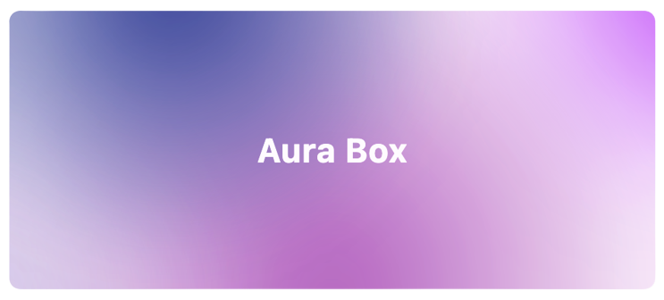
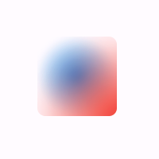

# Aura Box

[![style: very good analysis][very_good_analysis_badge]][very_good_analysis_link]
[![License: MIT][license_badge]][license_link]

Flutter widget that combines multiple radial gradients and blur effect.



[license_badge]: https://img.shields.io/badge/license-MIT-blue.svg
[license_link]: https://opensource.org/licenses/MIT
[very_good_analysis_badge]: https://img.shields.io/badge/style-very_good_analysis-B22C89.svg
[very_good_analysis_link]: https://pub.dev/packages/very_good_analysis


## Installation

Add this line into the project `pubspec.yaml` file.

```yaml
dependencies:
    aura_box:
```

Then in your files you can import it:

```dart
import 'package:aura_box/aura_box.dart';
```


## Usage

The package exposes two widgets.
- `AuraBox` acts as a container which can receive a `child`, a `decoration` and a list of `AuraSpot`.
- `AuraSpot` represent the point where the radiant gradients are generated.

```dart
AuraBox(
    spots: [
        // Places one blue spot in the center
        AuraSpot(
            color: Colors.blue,
            radius: 100.0,
            alignment: Alignment.center,
            blurRadius: 5.0,
            stops: const [0.0, 0.5],
        ),
        // Places one red spot in the bottom right
        AuraSpot(
            color: Colors.red,
            radius: 150.0,
            alignment: Alignment.bottomRight,
            blurRadius: 10.0,
            stops: const [0.0, 0.7],
        ),
    ],
    decoration: BoxDecoration(
        color: Colors.transparent,
        shape: BoxShape.rectangle,
        borderRadius: BorderRadius.circular(10.0),
    ),
    child: const SizedBox(
        height: 100,
        width: 100,
    ),
)
```



### Alignment

The single spots are positioned inside a stack widget.
This gives control over their position using the `alignment` property.

For further details you can refer to the [Alignment class documentation](https://api.flutter.dev/flutter/painting/Alignment-class.html).

## Example

An example project is available within the project.
Here's a video showcasing it:


https://github.com/GangemiLorenzo/aura_box/assets/26723808/3290b7c3-b9e1-4bee-a283-7470da076ba9


